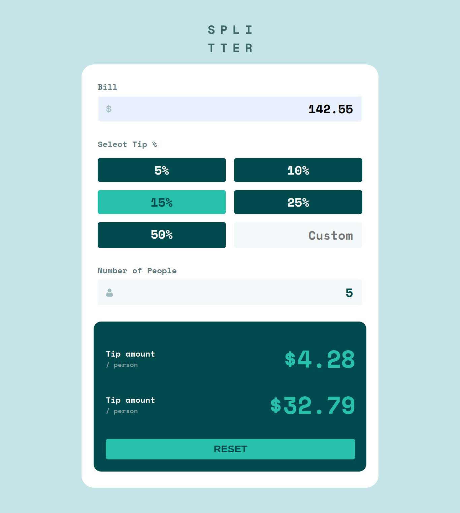

# Frontend Mentor - Tip calculator app

This is a solution to the [Tip Calculator App](https://www.frontendmentor.io/challenges/tip-calculator-app-ugJNGbJUX). Frontend Mentor challenges help you improve your coding skills by building realistic projects. 

## Table of contents

- [Overview](#overview)
  - [Screenshot](#screenshot)
  - [Links](#links)
- [My process](#my-process)
  - [Built with](#built-with)
  - [Useful resources](#useful-resources)
- [Author](#author)
- [Acknowledgments](#acknowledgments)

## Overview

### Screenshot

### Links

- Solution URL: [GitHub repository](https://github.com/welpmoz/tip-calculator-app).
- Live Site URL: [Live site](https://welpmoz.github.io/tip-calculator-app/)

## My process

### Built with

- Semantic HTML5 markup
- Vanilla Javascript
- CSS variables
- BEM methodology
- Google Fonts
- Git & GitHub
- Mobile first approach

### Useful resources

- [Responsively](https://responsively.app/): A best browser for develop responsive webs.
- [Google Fonts](https://fonts.google.com/): Provide beatiful fonts to integrate in your web sites.
- [CSS examples](https://github.com/lsvekis/HTML-CSS-Exercises-Book): Simple but powerful examples that improve my CSS skills.
- [w3schools](https://www.w3schools.com): Great resource that provide several examples of HTML, CSS & JavaScript.
- [animation rocks](https://cssanimation.rocks/): Provide several innovative ideas for animate your project.

## Author

- Github - [Roswell Jaime](https://github.com/welpmoz)
- Frontend Mentor - [@welpmoz](https://www.frontendmentor.io/profile/welpmoz)

## Acknowledgments

I greatly appreciate the work done by the Frontend Mentor team. Their challenges are diverse and well-suited for developers at all levels. Additionally, I'm grateful for the inclusion of Figma as a useful resource.